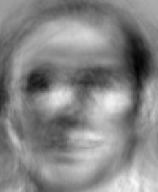

## Summary
An authentication system which uses the face and iris of the person as the parameters for the process itself. It includes extracting facial features as well as the processes of segmentation, normalization and iris coding in order to obtain unique characteristics from face and iris.

## Development environment
Complete algorithm is developed on Ubuntu 18.04 OS. Following hardware specification consists of:
- CPU: Intel Core i7-4770 CPU @ 3.40GHz x 8
- GPU: GeForce GTX 1080 Ti/PCIe/SSE2
- RAM: Kingston HyperX Fury Red 16 GB (2 x 8 GB)

The chosen language is MATLAB. The reason being is a wast number of functionalities, libraries and fast development rate.

## Results
### Face
<table>
	<tr>
		<td>Example of face image used in training process</td>
		<td>Example of Eigenface image</td>
		<td>Mean face of all training faces</td>
		<td>Example of one normalized face</td>
	</tr>
	<tr>
		<td></td>
		<td></td>
		<td></td>
		<td></td>
	</tr>
</table>

Eigenfaces after normalization process.
<table>
	<tr>
		<td></td>
		<td></td>
		<td></td>
		<td></td>
		<td></td>
	</tr>
	<tr>
		<td></td>
		<td></td>
		<td></td>
		<td></td>
		<td></td>
	</tr>
</table>
