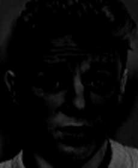

# Summary
An authentication system which uses the face and iris of the person as the parameters for the process itself. It includes extracting facial features as well as the processes of segmentation, normalization and iris coding in order to obtain unique characteristics from face and iris.

# Development environment
Complete algorithm is developed on Ubuntu 18.04 OS. Following hardware specification consists of:
- CPU: Intel Core i7-4770 CPU @ 3.40GHz x 8
- GPU: GeForce GTX 1080 Ti/PCIe/SSE2
- RAM: Kingston HyperX Fury Red 16 GB (2 x 8 GB)

The chosen language is MATLAB. The reason being is a wast number of functionalities, libraries and fast development rate.

# Samples
## Face
<table>
	<tr>
		<td>Example of face image used in training process.</td>
		<td></td>
	</tr>
	<tr>
		<td>Example of Eigenface image.</td>
		<td></td>
	</tr>
	<tr>
		<td>Mean face of all training faces.</td>
		<td></td>
	</tr>
	<tr>
		<td>Example of one normalized face.</td>
		<td></td>
	</tr>
</table>

**Eigenfaces after normalization process:**
<table>
	<tr>
		<td></td>
		<td></td>
		<td></td>
		<td></td>
		<td></td>
	</tr>
	<tr>
		<td></td>
		<td></td>
		<td></td>
		<td></td>
		<td></td>
	</tr>
</table>

## Iris
<table>
	<tr>
		<td>Example of eye image used for testing. Area between sclera and pupil is called iris.</td>
		<td></td>
	</tr>
	<tr>
		<td>Output image of Canny edge detector. Edges of the iris and pupil can be seen clearly.</td>
		<td></td>
	</tr>
	<tr>
		<td>Outer boundaries of iris and pupil. Area between them is iris.</td>
		<td></td>
	</tr>
</table>

**Iris segmentation process (first row represents good sample, while second bad one):**
<table>
	<tr>
		<td></td>
		<td></td>
		<td></td>
	</tr>
	<tr>
		<td></td>
		<td></td>
		<td></td>
	</tr>
</table>

<table>
	<tr>
		<td>An example of normalized iris.</td>
	</tr>
	<tr>
		<td></td>
	</tr>
</table>

<table>
	<tr>
		<td>Iris noise mask. This mask shows regions of iris that are not usable during the process of authentication.</td>
	</tr>
	<tr>
		<td></td>
	</tr>
</table>

<table>
	<tr>
		<td>An example of a coded iris. This form, along with the noise mask, is used for authentication of a person.</td>
	</tr>
	<tr>
		<td></td>
	</tr>
</table>

## Final results using this technique and algorithm are presented in the research paper.